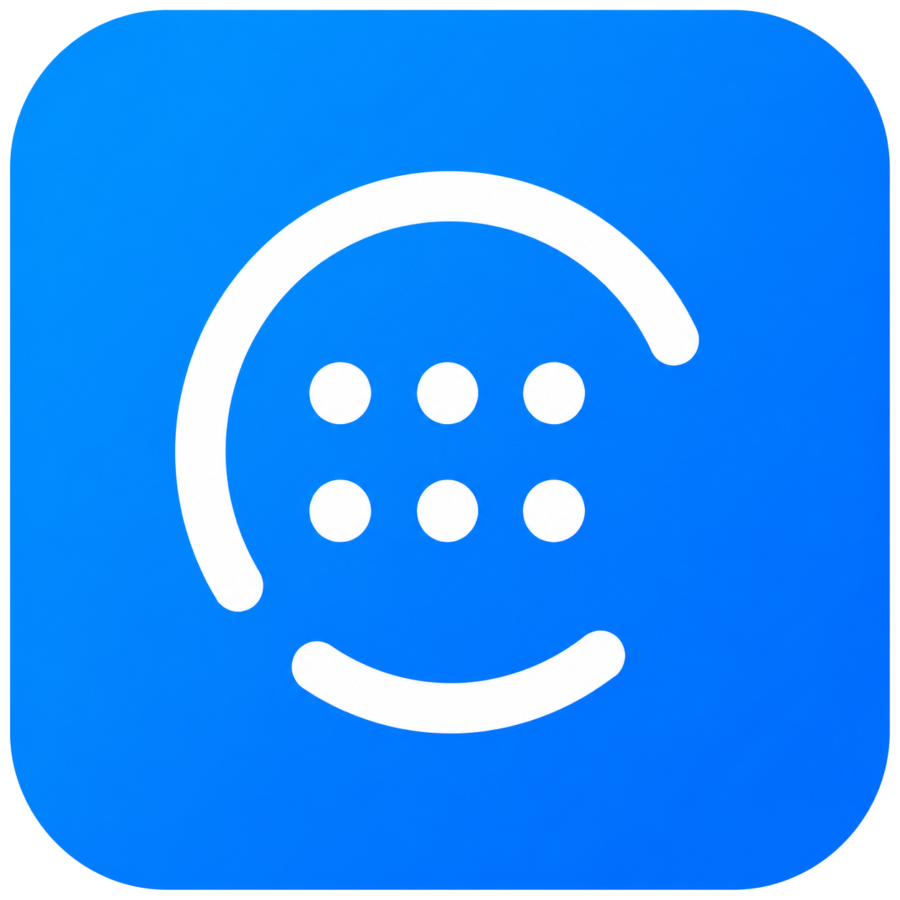

<p align="center">
  
</p>

<h1 align="center">MyTokens</h1>

<p align="center">An offline, secure TOTP authenticator for Android.</p>

<p align="center">
  <a href="https://github.com/guilhermegsr/my_tokens/actions/workflows/ci.yml">
    
  </a>
  
  
  
  
  
</p>

<p align="center">
  <a href="https://github.com/guilhermegsr/my_tokens/releases/latest">
    
  </a>
</p>

---

MyTokens generates TOTP verification codes (RFC 6238) for two-factor
accounts. It has no internet permission: every secret stays encrypted
on the device and nothing is ever transmitted.

## Features

- TOTP codes — SHA1/256/512, 6–8 digits, custom period
- QR scan or manual entry, with duplicate rejection
- Password-encrypted backup export / import
- Biometric / device lock with configurable timeout
- Out-of-sync clock detection
- Light and dark themes
- English and Portuguese, following the device locale

## Security

- No internet permission; no telemetry
- Secrets in an AES-256-GCM vault; key held in the Android Keystore,
  never written in cleartext
- Backups encrypted with the user password via Argon2id
- Screenshots and the app-switcher preview are blocked

## Install

Download the signed APK from the
[latest release](https://github.com/guilhermegsr/my_tokens/releases/latest)
and install it on your Android device. No Play Store account, build tooling,
or developer setup required.

### Build from source (optional)

Only needed for development. Requires the Flutter SDK.

```
flutter pub get
flutter build apk --release
```

Release signing and publishing are documented in [RELEASE.md](RELEASE.md).
