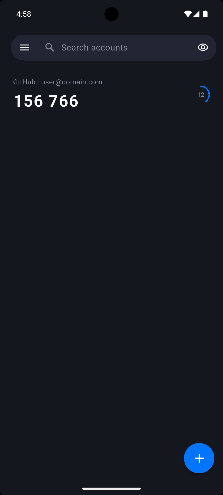
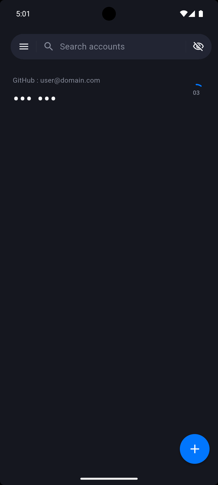
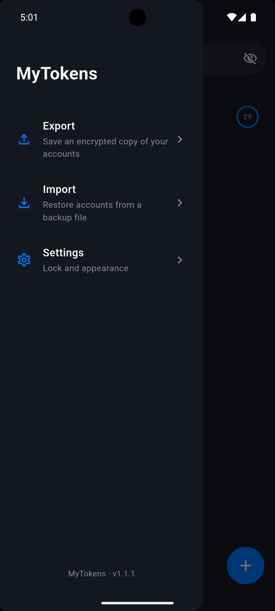
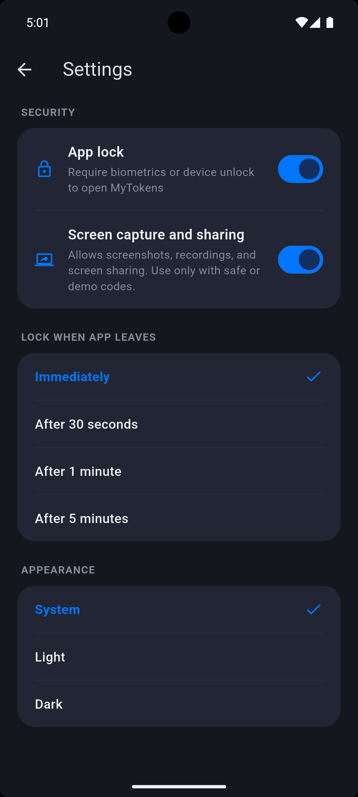

<p align="center">
  
</p>

<h1 align="center">MyTokens</h1>

<p align="center">
  <strong>2FA privado para Android. Sem nuvem. Sem conta. Sem permissão de internet.</strong>
</p>

<p align="center">
  MyTokens é um autenticador 2FA offline para Android que mantém seus códigos
  de verificação criptografados no seu dispositivo e prontos quando você precisa.
</p>

<p align="center">
  <a href="README.md">English</a> · <strong>Português</strong>
</p>

<p align="center">
  <a href="https://github.com/guilhermegsr/my_tokens/releases/latest">
    
  </a>
</p>

<p align="center">
  <a href="https://github.com/guilhermegsr/my_tokens/actions/workflows/ci.yml">
    
  </a>
  
  
  
  
  
</p>

---

## Por que MyTokens

A maioria dos autenticadores força uma troca entre conveniência e controle.
MyTokens foi criado para quem quer um autenticador bonito e prático no dia a
dia sem enviar seus segredos para um serviço de terceiros.

| Privado por padrão | Feito para uso real | Seguro quando importa |
| --- | --- | --- |
| Sem contas, telemetria, backend, sincronização em nuvem ou permissão de internet. | Busca rápida, ocultação de códigos, cadastro por QR Code, backups criptografados e temas claro/escuro. | Cofre AES-256-GCM, proteção pelo Android Keystore, bloqueio do app e bloqueio de prints por padrão. |

## Tour do produto

<table>
  <tr>
    <td align="center" width="50%">
      
      <br />
      <strong>Códigos à primeira vista</strong>
      <br />
      <sub>Pesquise contas rapidamente, veja o código atual e acompanhe o tempo restante com uma contagem clara.</sub>
    </td>
    <td align="center" width="50%">
      
      <br />
      <strong>Oculte códigos instantaneamente</strong>
      <br />
      <sub>Mascare tokens quando estiver perto de outras pessoas, gravando uma demonstração ou compartilhando a tela.</sub>
    </td>
  </tr>
  <tr>
    <td align="center" width="50%">
      
      <br />
      <strong>Backup e restauração</strong>
      <br />
      <sub>Exporte um backup protegido por senha e restaure depois sem depender de uma conta na nuvem.</sub>
    </td>
    <td align="center" width="50%">
      
      <br />
      <strong>Controles de segurança</strong>
      <br />
      <sub>Escolha o comportamento do bloqueio do app e permita prints, gravações ou compartilhamento de tela somente quando precisar.</sub>
    </td>
  </tr>
</table>

<p align="center"><sub>As capturas usam dados fictícios. Captura de tela é bloqueada por padrão.</sub></p>

## Destaques

- **Operação 100% offline** - sem permissão de rede, sem dependência de
  servidor e sem sincronização oculta.
- **TOTP compatível com padrões** - suporte ao RFC 6238 com SHA-1, SHA-256,
  SHA-512, 6-8 dígitos e períodos personalizados.
- **Cofre local criptografado** - nomes de contas e segredos são criptografados
  em repouso com AES-256-GCM.
- **Chave protegida por hardware** - a chave do cofre é gerada localmente e
  selada pelo Android Keystore.
- **Backups portáveis e seguros** - exportações são criptografadas com sua
  senha e reforçadas com Argon2id.
- **Bloqueio opcional do app** - exija biometria ou credenciais do aparelho,
  com período de tolerância configurável.
- **Controles de privacidade da tela** - prints, gravações, compartilhamento de
  tela e preview nos apps recentes são bloqueados por padrão, com liberação
  manual.
- **Polimento para o dia a dia** - ocultação de códigos, detecção de duplicatas,
  avisos de relógio incorreto, UI responsiva, temas claro/escuro e localização
  em inglês/português.

## Modelo de segurança

MyTokens segue um princípio simples: segredos de autenticação não devem sair do
dispositivo, a menos que o usuário exporte intencionalmente um backup
criptografado.

- MyTokens não solicita a permissão Android `INTERNET`.
- Segredos de contas ficam somente no cofre local criptografado.
- A chave do cofre é gerada no dispositivo e protegida pelo Android Keystore.
- Backups são criptografados antes de sair do app, usando uma senha escolhida
  pelo usuário.
- Configurações sensíveis de segurança são armazenadas em armazenamento seguro
  do sistema operacional.
- Backups por nuvem e transferência de dispositivo do cofre são desativados no
  Android.
- Prints e compartilhamento de tela são bloqueados, exceto quando ativados
  explicitamente nas configurações.

Para reportar vulnerabilidades, veja [SECURITY.md](SECURITY.md).

## Instalação

Baixe o APK assinado na
**[release mais recente](https://github.com/guilhermegsr/my_tokens/releases/latest)**.
Não é necessário ter conta em loja, configuração em nuvem ou acesso à internet.

## Build a partir do código-fonte

Requisitos:

- Flutter stable
- Android SDK com licenças aceitas
- JDK compatível com o Android Gradle Plugin

Comandos comuns de desenvolvimento:

```bash
flutter pub get
flutter test
flutter build apk --debug
```

Notas sobre assinatura de release e distribuição estão documentadas em
[RELEASE.md](RELEASE.md).

## Privacidade

MyTokens foi projetado para que seus dados de autenticação nunca saiam do seu
dispositivo. A política de privacidade completa está em [PRIVACY.md](PRIVACY.md).

## Licença

MyTokens é distribuído sob a [Licença MIT](LICENSE).
